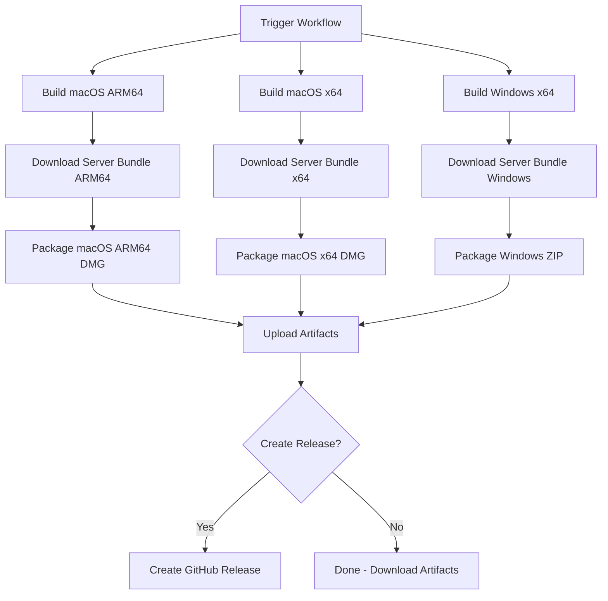

# DMTools Desktop App Packaging Guide

Complete guide for packaging DMTools Flutter apps with embedded server.

## 🎯 Overview

This packaging system creates standalone desktop applications that include:
- Flutter UI application
- DMTools server (with embedded JRE)
- Automatic server startup and port management
- No external dependencies required

## 📦 What Was Created

### 1. Packaging Scripts (`scripts/`)

- **`pack-macos.sh`** - Creates macOS `.dmg` with embedded server
- **`pack-windows.sh`** - Creates Windows `.zip` with embedded server
- **`test-packaging.sh`** - Local testing script
- **`README.md`** - Detailed script documentation

### 2. GitHub Workflow

- **`.github/workflows/package-apps.yml`** - Automated packaging workflow
- Builds for macOS (Apple Silicon + Intel) and Windows
- Downloads server bundles from dmtools releases
- Creates distributable packages

### 3. Features

✅ **Embedded Server** - DMTools server included in app bundle  
✅ **Embedded JRE** - No Java installation required  
✅ **Port Management** - Automatic port conflict resolution  
✅ **Native Launchers** - macOS dialog + Windows console prompts  
✅ **Cross-Platform** - macOS and Windows support  
✅ **Automatic Startup** - Server starts before app launches  

## 🚀 Quick Start - Test Locally

### Prerequisites

- Flutter installed and in PATH
- macOS or Linux (for running scripts)
- Internet connection (to download server bundles)

### Run Test

```bash
cd /Users/Uladzimir_Klyshevich/git/dmtools/dmtools-flutter

# Test with latest server version
./scripts/test-packaging.sh

# Or specify version
./scripts/test-packaging.sh v1.7.77
```

**This will:**
1. Download server bundle (if needed)
2. Build Flutter app for your architecture
3. Package everything into a DMG
4. Place output in `dist-test/` directory

**To test the package:**
```bash
open dist-test/DMTools-*.dmg
```

Then drag DMTools to Applications and launch it.

## 🤖 GitHub Actions - Automated Packaging

### Trigger Workflow

1. Go to: https://github.com/IstiN/dmtools-flutter/actions
2. Select workflow: **"Package DMTools Apps"**
3. Click **"Run workflow"**
4. Fill in parameters:
   - **Server version:** `v1.7.77` (or your target version)
   - **Flutter version:** Leave empty for latest stable
   - **Create release:** ✅ Check to create GitHub release

### Workflow Process



### Download Artifacts

After workflow completes:

1. Go to workflow run
2. Scroll to **Artifacts** section
3. Download:
   - `dmtools-macos-arm64` - macOS Apple Silicon DMG
   - `dmtools-macos-x64` - macOS Intel DMG
   - `dmtools-windows-x64` - Windows ZIP

### Published Release

If "Create release" was checked, find release at:
- https://github.com/IstiN/dmtools-flutter/releases
- Tag: `flutter-v1.7.77` (based on server version)

## 📁 Package Contents

### macOS DMG

```
DMTools-v1.7.77-macos-arm64.dmg
└── DMTools.app/
    ├── Contents/
    │   ├── MacOS/
    │   │   ├── dmtools         # Wrapper (starts server, then app)
    │   │   └── dmtools.bin     # Original Flutter executable
    │   ├── Resources/
    │   │   ├── server/         # Embedded server
    │   │   │   ├── launch.sh   # Server launcher with port handling
    │   │   │   ├── run.sh      # Server startup script
    │   │   │   ├── jre/        # Embedded Java Runtime
    │   │   │   ├── dmtools-standalone.jar
    │   │   │   └── dmtools-server.log (created at runtime)
    │   │   └── (Flutter assets)
    │   └── Info.plist
```

### Windows ZIP

```
DMTools-v1.7.77-windows-x64.zip
└── DMTools-v1.7.77-windows-x64/
    ├── dmtools.exe              # Flutter application
    ├── launch.cmd               # Main launcher (starts server, then app)
    ├── server/                  # Embedded server
    │   ├── run.cmd              # Server startup script
    │   ├── jre/                 # Embedded Java Runtime
    │   ├── dmtools-standalone.jar
    │   └── dmtools-server.log   # Created at runtime
    ├── data/                    # Flutter dependencies
    └── README.txt               # User instructions
```

## 🔧 How It Works

### Startup Sequence

1. **User launches app**
   - macOS: Opens DMTools.app
   - Windows: Runs launch.cmd

2. **Port check**
   - Checks if port 8080 is available
   - If busy: Prompts user for alternative port

3. **Start server**
   - Launches embedded server on selected port
   - Waits for health check (max 60 seconds)
   - Logs to `dmtools-server.log`

4. **Launch app**
   - Starts Flutter app with `--server-port` parameter
   - App connects to local server
   - User sees UI

### Port Management

**Default Port:** 8080

**If port is busy:**

- **macOS:** Native dialog prompts for alternative port
- **Windows:** Console prompt for alternative port

**Custom port via environment:**

```bash
# macOS
export DMTOOLS_PORT=9090
open /Applications/DMTools.app

# Windows
set DMTOOLS_PORT=9090
launch.cmd
```

### Server Logs

**Location:**
- **macOS:** `DMTools.app/Contents/Resources/server/dmtools-server.log`
- **Windows:** `server/dmtools-server.log`

**View logs:**

```bash
# macOS
tail -f /Applications/DMTools.app/Contents/Resources/server/dmtools-server.log

# Windows
type server\dmtools-server.log
```

## 🧪 Testing

### Test Locally (macOS)

```bash
# 1. Run test script
./scripts/test-packaging.sh

# 2. Open DMG
open dist-test/*.dmg

# 3. Drag to Applications
cp -r /Volumes/DMTools*/DMTools.app /Applications/

# 4. Launch
open /Applications/DMTools.app

# 5. Check if server started
curl http://localhost:8080/actuator/health

# 6. Check logs
tail -f /Applications/DMTools.app/Contents/Resources/server/dmtools-server.log
```

### Test Port Conflict

```bash
# Occupy port 8080
python3 -m http.server 8080 &

# Launch app - should prompt for alternative port
open /Applications/DMTools.app

# Cleanup
kill %1
```

### Test Custom Port

```bash
# Set custom port
export DMTOOLS_PORT=9090

# Launch
open /Applications/DMTools.app

# Verify server on custom port
curl http://localhost:9090/actuator/health
```

## 🐛 Troubleshooting

### Build Issues

#### "Flutter not found"
```bash
# Install Flutter
# https://docs.flutter.dev/get-started/install

# Add to PATH
export PATH="$PATH:/path/to/flutter/bin"
```

#### "Server bundle download failed"
```bash
# Download manually from:
# https://github.com/IstiN/dmtools/releases/tag/v1.7.77

# Then run with local bundle:
./scripts/test-packaging.sh v1.7.77 /path/to/dmtools-server-api-macos-aarch64.zip
```

### Runtime Issues

#### Server fails to start

**Check:**
1. Port availability: `lsof -i :8080` (macOS) or `netstat -ano | findstr :8080` (Windows)
2. Server logs in app bundle
3. JRE is present in server bundle

**Fix:**
- Kill process using port 8080
- Launch with custom port
- Check server logs for errors

#### macOS: "App is damaged"

```bash
# Remove quarantine
xattr -cr /Applications/DMTools.app

# Or during testing:
xattr -cr dist-test/*.dmg
```

#### Windows: "Windows protected your PC"

- Click **"More info"** → **"Run anyway"**
- Or add folder to Windows Defender exclusions

#### App launches but can't connect to server

**Check:**
1. Server log for errors
2. Port in use by server
3. Firewall settings

```bash
# Check what port server is using
cat /Applications/DMTools.app/Contents/Resources/server/server-port.txt
```

## 📝 Manual Packaging

If you need to package manually (outside workflow):

### macOS

```bash
# 1. Build Flutter
flutter build macos --release

# 2. Download server bundle
curl -L -o dmtools-server-api-macos-aarch64.zip \
  "https://github.com/IstiN/dmtools/releases/download/v1.7.77/dmtools-server-api-macos-aarch64.zip"

# 3. Package
./scripts/pack-macos.sh \
  build/macos/Build/Products/Release/dmtools.app \
  dmtools-server-api-macos-aarch64.zip \
  dist \
  v1.7.77
```

### Windows

```bash
# 1. Build Flutter (on Windows)
flutter build windows --release

# 2. Download server bundle
curl -L -o dmtools-server-api-windows-x64.zip \
  "https://github.com/IstiN/dmtools/releases/download/v1.7.77/dmtools-server-api-windows-x64.zip"

# 3. Package (can run on macOS/Linux with zip)
./scripts/pack-windows.sh \
  build/windows/x64/runner/Release \
  dmtools-server-api-windows-x64.zip \
  dist \
  v1.7.77
```

## 🔐 Security & Distribution

### Current State

- **Unsigned** - Apps are not code-signed
- **Unnotarized** - macOS apps not notarized
- **SmartScreen warnings** - Windows shows warnings

### For Production

**macOS:**
```bash
# Sign the app
codesign --force --deep --sign "Developer ID Application: YourName" \
  /Applications/DMTools.app

# Notarize
xcrun notarytool submit DMTools.dmg \
  --apple-id your@email.com \
  --password app-specific-password \
  --team-id TEAMID

# Staple notarization
xcrun stapler staple /Applications/DMTools.app
```

**Windows:**
```bash
# Sign the executable
signtool sign /f certificate.pfx /p password \
  /t http://timestamp.digicert.com \
  dmtools.exe
```

## 📊 Size Estimates

Based on server version v1.7.77:

| Platform | Package Size | Installed Size |
|----------|--------------|----------------|
| macOS Apple Silicon | ~200MB | ~250MB |
| macOS Intel | ~195MB | ~245MB |
| Windows x64 | ~190MB | ~240MB |

**Size breakdown:**
- Flutter app: ~50MB
- Server JAR: ~30MB
- Embedded JRE: ~100MB
- Dependencies: ~10MB

## 🔄 Updating

### Update Server Version

1. New dmtools release published
2. Trigger workflow with new version tag
3. New packages created automatically

### Update Flutter App

1. Make changes to Flutter code
2. Commit and push
3. Trigger workflow with server version
4. New packages include updated Flutter app

## 📚 Additional Resources

- **Scripts README:** `scripts/README.md` - Detailed script documentation
- **DMTools Server:** https://github.com/IstiN/dmtools
- **Flutter Desktop:** https://docs.flutter.dev/desktop
- **GitHub Actions:** `.github/workflows/package-apps.yml`

## 🤝 Contributing

To improve packaging:

1. Test changes locally with `test-packaging.sh`
2. Test on both macOS and Windows
3. Update scripts and documentation
4. Test GitHub Actions workflow
5. Submit PR with thorough testing notes

---

**Questions or Issues?**  
Open an issue: https://github.com/IstiN/dmtools-flutter/issues

**Need Help?**  
Check `scripts/README.md` for detailed documentation.

