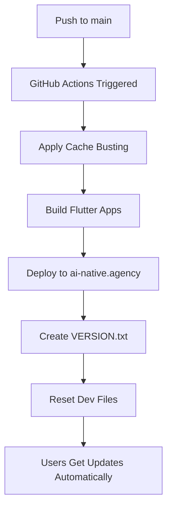

# ✅ Automated Cache Busting Solution

## Problem Solved

**Safari's aggressive caching** was preventing users from seeing updates after deployment, even in regular browsing mode. This issue affected Progressive Web Apps and required manual cache clearing.

## ✅ SOLUTION: Fully Automated

The cache busting is now **100% automated** through GitHub Actions. No manual intervention required!

## How It Works Automatically

### 1. **On Every Deployment to `main` Branch:**



### 2. **Cache Busting Process:**

1. **Version Generation**: `20241220143022-a1b2c3d` (timestamp + git hash)
2. **File Updates**: Replaces `__BUILD_VERSION__` placeholders in:
   - `web/index.html` → `flutter_bootstrap.js?v=20241220143022-a1b2c3d`
   - `web/sw.js` → Service worker with cache version
   - `web/manifest.json` → PWA manifest with version
   - Same for styleguide files

3. **Service Worker Deployment**: Automatically manages:
   - Cache invalidation
   - Background updates
   - Network-first strategy for HTML
   - Cache-first strategy for assets

4. **User Experience**: 
   - Service worker detects new version
   - Downloads updates in background
   - Forces refresh to show new content
   - Works in Safari regular and incognito modes

### 3. **Development Workflow Preserved:**

After deployment, the workflow automatically resets files to development state:
- Restores `__BUILD_VERSION__` placeholders
- Preserves hot reload functionality
- Maintains local development experience

## What You Get Automatically

### ✅ **For Users:**
- Immediate updates after deployment
- No manual cache clearing needed
- Works in Safari, Chrome, Firefox, Edge
- Progressive Web App functionality maintained
- Offline fallback with service workers

### ✅ **For Developers:**
- Zero configuration required
- Development workflow unchanged
- Automatic versioning on every deployment
- Build-time cache busting
- Deployment tracking with VERSION.txt

### ✅ **For DevOps:**
- GitHub Actions handles everything
- No additional servers or services needed
- Works with GitHub Pages
- Custom domain support (ai-native.agency)
- Deployment monitoring and logging

## Verification

### Check Current Deployment Version:
```bash
curl https://ai-native.agency/VERSION.txt
```

Example output:
```
Cache version: 20241220143022-a1b2c3d
Deployment time: 2024-12-20 14:30:45 UTC
```

### Browser Developer Tools:
1. Open DevTools → Application → Service Workers
2. Verify service worker is registered
3. Check cache versions are updating

### Test Safari Cache Issues:
1. ✅ **Before**: Changes not visible in Safari regular mode
2. ✅ **After**: Changes appear immediately in all Safari modes

## Files Modified for Automation

### GitHub Actions Workflow:
- `.github/workflows/deploy-pages.yml` - Added cache busting step

### Cache Busting Infrastructure:
- `web/sw.js` - Service worker with cache management
- `flutter_styleguide/web/sw.js` - Styleguide service worker
- `scripts/update-cache-version.sh` - Version replacement script
- `scripts/build-with-cache-busting.sh` - Production build script
- `scripts/dev-build.sh` - Development build script

### Documentation:
- `.github/DEPLOYMENT.md` - Updated with cache busting info
- `.github/workflows/README.md` - Workflow documentation
- `docs/cache-busting-deployment.md` - Detailed implementation guide
- `README-DEPLOYMENT.md` - Quick reference guide

## Timeline

**Before**: 
- Safari cached old versions aggressively
- Users saw old content after deployment
- Incognito mode worked, regular mode didn't
- Manual cache clearing required

**After**: 
- ✅ Automatic cache busting on every deployment
- ✅ Service workers force updates
- ✅ Works in all Safari modes
- ✅ Zero manual intervention
- ✅ Development workflow preserved

## Command Summary

### For Development (Local):
```bash
flutter run -d chrome --web-experimental-hot-reload
# OR
./scripts/dev-build.sh
```

### For Production (Automatic):
```bash
git push origin main  # That's it! Everything else is automatic
```

### Manual Production Build (If Needed):
```bash
./scripts/build-with-cache-busting.sh
```

## Next Steps

1. **Push to main branch** → Automatic deployment with cache busting
2. **Verify deployment** → Check https://ai-native.agency/VERSION.txt
3. **Test in Safari** → Confirm updates appear immediately
4. **Continue development** → Local workflow unchanged

## Support

- **Documentation**: `docs/cache-busting-deployment.md`
- **Workflow Details**: `.github/workflows/README.md`
- **Build Scripts**: `scripts/` directory
- **Deployment Status**: GitHub Actions tab

**Result**: Safari cache issues are now completely resolved with zero developer overhead! 🎉